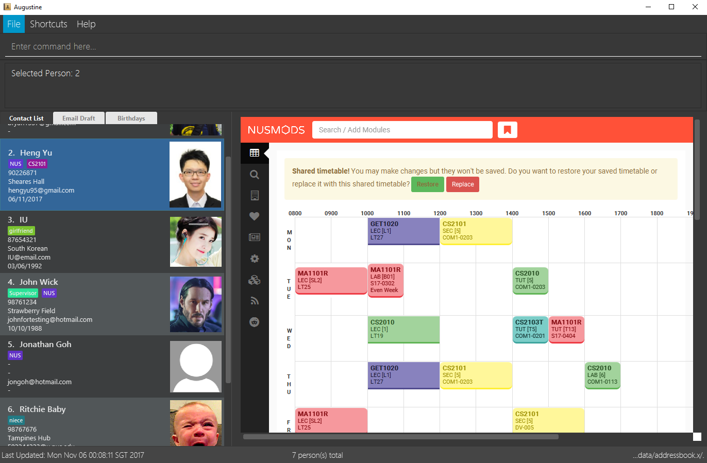

= Augustine
ifdef::env-github,env-browser[:relfileprefix: docs/]
ifdef::env-github,env-browser[:outfilesuffix: .adoc]

https://travis-ci.org/CS2103AUG2017-W14-B2/main[image:https://travis-ci.org/CS2103AUG2017-W14-B2/main.svg?branch=master[Build Status]]
https://ci.appveyor.com/project/wenzongteo/main[image:https://ci.appveyor.com/api/projects/status/bvhadmjhxhhu4nnw?svg=true[Build status]]
https://coveralls.io/github/CS2103AUG2017-W14-B2/main?branch=master[image:https://coveralls.io/repos/github/CS2103AUG2017-W14-B2/main/badge.svg?branch=master[Coverage Status]]

* Augustine is an address book application which is able to store and display NUSmods timetables.
* It is designed with NUS students in mind.

== Site Map

* <<UserGuide#, User Guide>>
* <<DeveloperGuide#, Developer Guide>>
* <<LearningOutcomes#, Learning Outcomes>>
* <<AboutUs#, About Us>>
* <<ContactUs#, Contact Us>>

== Acknowledgements

* This application was further improved from https://github.com/se-edu/addressbook-level4/tree/master by _Team SE-EDU_.
* Some parts of this application were inspired by the excellent http://code.makery.ch/library/javafx-8-tutorial/[Java FX tutorial] by
_Marco Jakob_.

== Licence : link:LICENSE[MIT]
